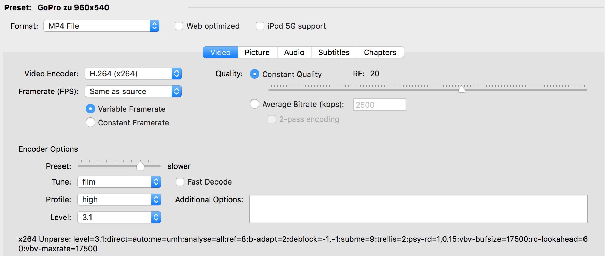
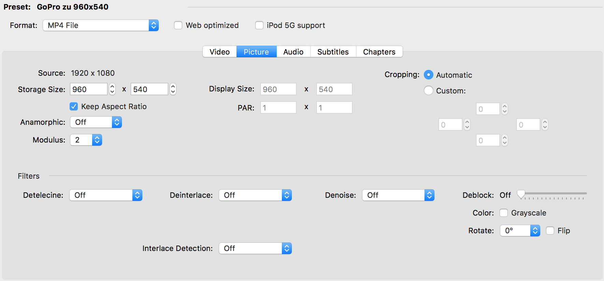
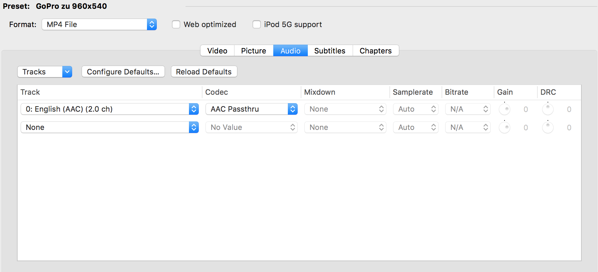
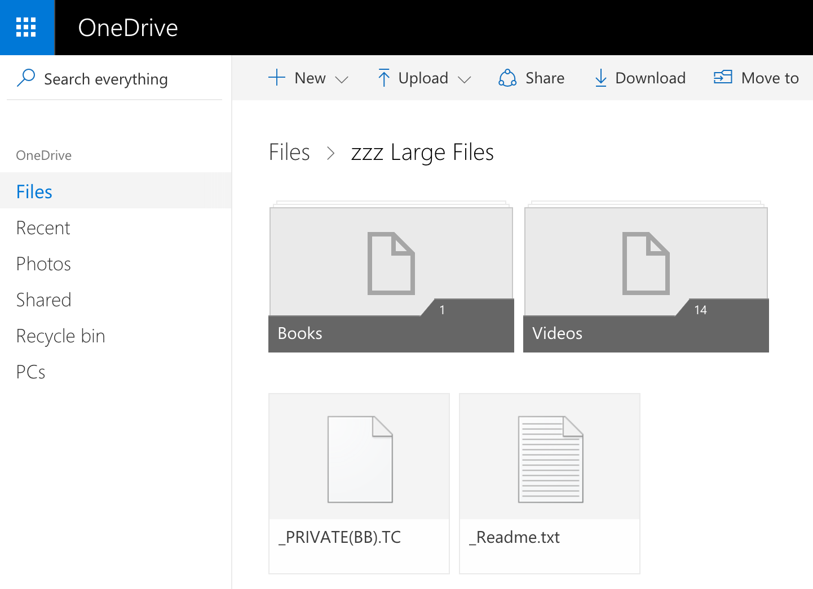
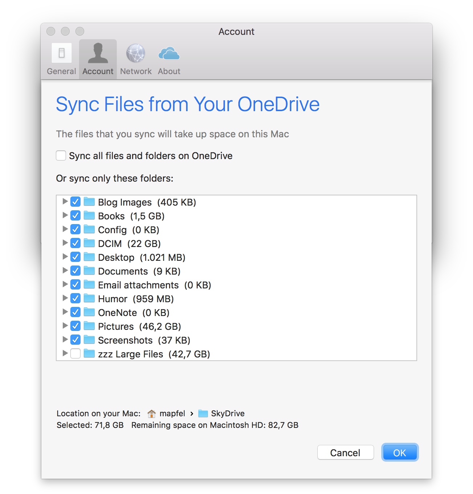

# Overview

This blog entry describes a HandBrakeCLI based toolchain to shrink videos and keep the footprint of videos on my daily machine smaller.

## Motivation

Over the last years the videos of my activities get bigger and bigger. Notably the GoPro videos of the last two years occupied around 20 percent of my over all space of pictures and videos. Unfortunatelly this consumed too much disc space that I run often in scenarios with critical disk capacities on my machine.

Because I'm an Office 365 Home user there is the option to save enough stuff in the cloud (1TB) and with OneDrive it is possible to decide which folders should be synchronized. Putting the big beasts of video in such an unsynchronized location and keeping only a shrinked video in the local folders gives the chance to avoid losing videos as well as keeping the amout of necessary disk space small.

HandBrake is a tool with a sophisticated UI to transcode videos (convert formats, clip areas, change resolutions,..). It is perfect to transcode individual files, but the batch mode is not an option. Here comes HandBrakeCLI into play. It allows conversion as a command in a terminal session. Preparing the conversions with HandBrake and use the presets with HandBrakeCLI in batch mode will be the aim.

# Realization

## Install HandBrake and HandBrakeCLI

HandBrake and HandBrakeCLI were installed around two years ago. Unfortunatelly in the later described circumstances they didn't worked together in a necessary manner. Additionally it was not so easy to update them. Last time I used homebrew (```brew cask install handbrakecli```). But this only installs an old version (0.10.5) which is again incompatible with HandBrake.

The web page [HandBrakeCLI Downloads](https://handbrake.fr/downloads2.php) offers version 1.0.2 which is capable to support my workflow.

Something similar appeared with HandBrake. So also download it as a DMG from the web [HandBrake Downloads](https://handbrake.fr/downloads.php) and install it manually.

## Prepare the preset

With HandBrake it is easy to create and test some presets. I started with the a given preset of AppleTV or Android and adjusted the paremeters for my needs.

### Generic Options

| Parameter      | Value           | Remark |
|----------------|-----------------|--------|
| Format         | MP4 File        | I want to have mp4 |

### Video Options

| Parameter      | Value           | Remark |
|----------------|-----------------|--------|
| Video Encoder  | H.264 (x264)    | H.264 is a good decision, not too new as H.265 and not too old as MPEG |
| Quality        | Constant, RF 20 | Average Bitrate is necessary if you have to hit a file size limit and RF 20 is according other blog entries good enough |
| Framerate      | Same as source  | it is faster to transcode and avoids picture defects |
| Encode Options |                 |        |
| Preset         | Slower          | I don't know. Seems to be a good balance between time and quality |
| Tune           | Film            | Because it is the best fitting option for my videos |
| Profile        | High            | I don't know. |
| Level          | 3.1             | Good balance between new features and support for older devices |



### Picture Options

| Parameter      | Value           | Remark |
|----------------|-----------------|--------|
| Storage Size   | 960x540         | Keep the same aspect ratio as the source! |
| Cropping       | no cropping     | all margins to 0 to avoid cropping |
| Anamorphic     | Off             | My sources aren't anamorphic |



### Audio Options

In case there are multiple Audio tracks, delete the unwanted.

| Parameter      | Value           | Remark |
|----------------|-----------------|--------|
| Codec          | AAC Passthru    | Changing the audio format was not necessary. So I keep the original audio track |



Save that preset for later usage. I named that preset ```GoPro zu 960x540```

## Use HandBrakeCLI in batch conversions

Now it is time to open a terminal.

Navigate to the folder were you like to shrink the videos.

Run this command:

```{.prompt}
for file in `ls GOPR*.MP4`; do $(HandBrakeCLI -v -i ${file} -o "${file%.MP4}.small.mp4" 
-Z "GoPro zu 960x540" --preset-import-gui); done```
```
(remove the line-break in front of the ```-Z``` parameter!)

What it does:

1. It collects all GoPro videos  
```for file in `ls GOPR*.MP4```

2. Transcodes each video  
```HandBrakeCLI -i ${file} ...```

3. By using the saved preset  
```-Z "GoPro zu 960x540"```

4. saved preset comes from HandBrake UI  
```--preset-import-gui```

5. Saves the transcoded video with an introduced ```small``` hint  
```-o "${file%.MP4}.small.mp4```

Usually the shrinked videos have a new size between 10 and 25 percent of the original.

## Use OneDrive to keep the hugh originals

At the root level I have created a folder named ```zzz Large Files```.  


In the preferences of OneDrive I exclude this folder from synchronization.  


Now we can easily move the large originals via web front end from the source folder to the new folder for our large videos. 

During synchronization that will remove the large file from the source folder on the disk and keep the original without to put it on the disc.

 

 

